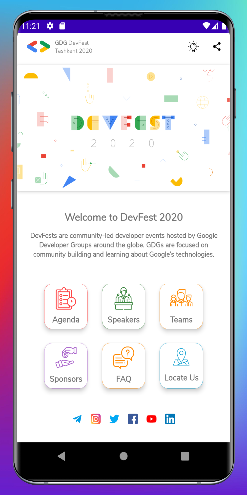
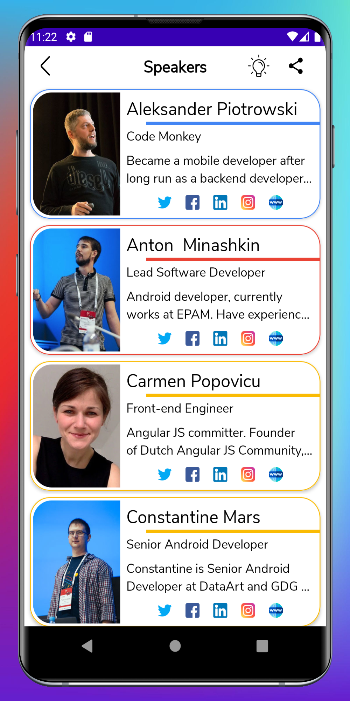
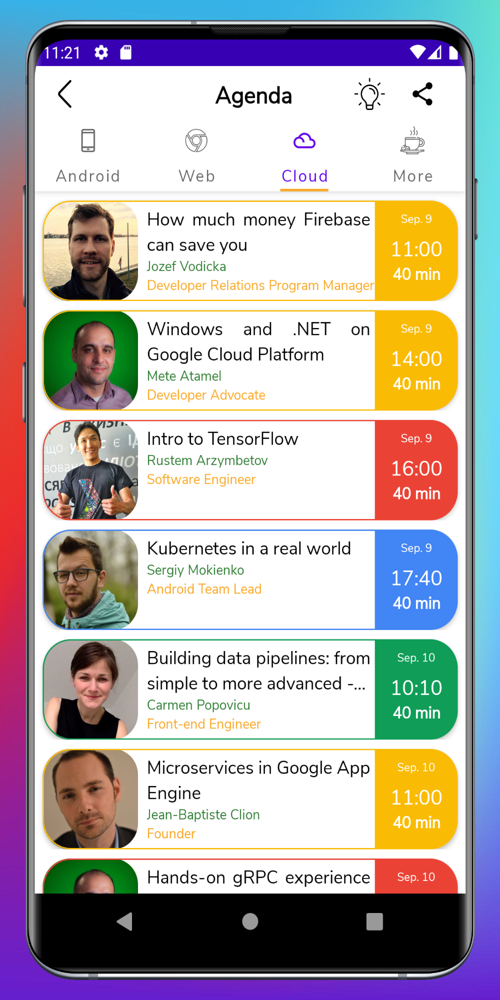
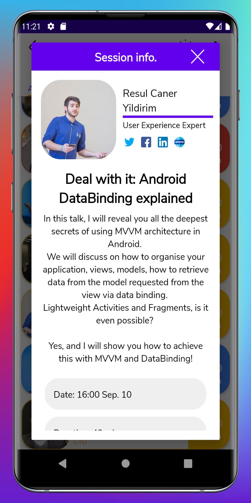
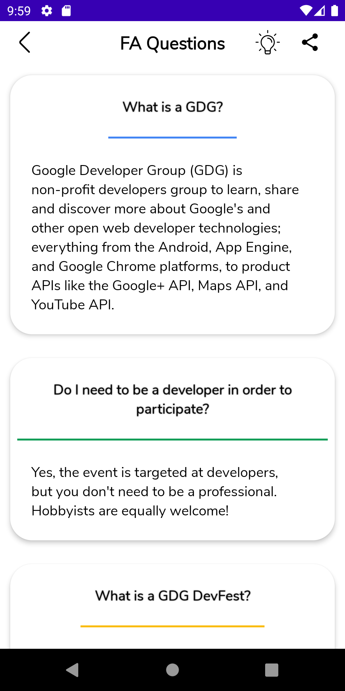
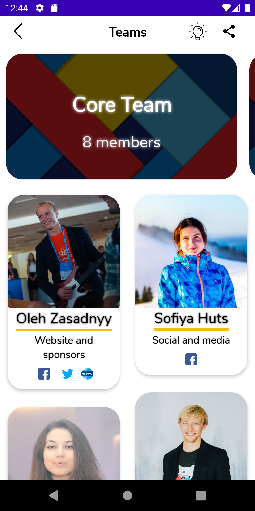
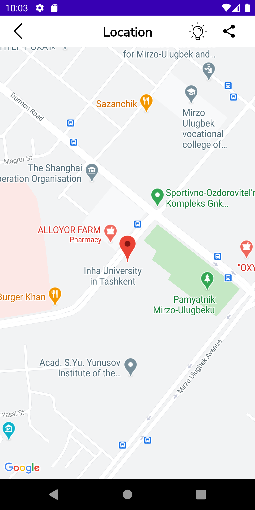

# GDG-DevFest All Done
Safarov Sokhibjon

GitHub: https://github.com/Sokhibjon18/GDG-DevFest  

 

<b>GDG DevFest Tashkent 2020</b>

Users able to view and click list of functionalities of the app, such as: Agenda, Speakers, GDG team, Sponsors of the event, FAQ, Location of the event.

Users able to view and clicking on them: Topic title, speaker details, start time of session and how long session will lastand.

And Sessions are grouped: Mobile, Cloud, Web, Others.

Users able to view team memeber details: fullname, image, position

Users able to view list of sponsors and clicking on them.

Users able to view in the google map location of the event.

Users able to view questions and answers to them.

Used JSON which located in firebase realtime database

 

<b>Addisional</b>

Modifications have been made to the design section also to avoid plagiarism

Used Database in order to allow users to use application without internet connection

And also size is very small

Temporarily placed in the google play market

https://play.google.com/store/apps/details?id=uz.triples.gdgdevfest

 

<b>Images</b>

 
 

 
 

 
 
 

